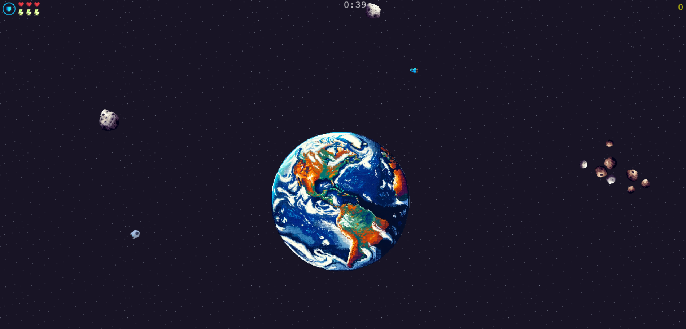

# interstellar-interceptor

## 1. Description
Interstellar Interceptor is an action-packed space shooter game built with Phaser 3.

## 2. Features
- Dynamic space environments
- Player ship with health and shield mechanics
- Alien ships with tracking behavior
- Various power-ups and upgrades
- Score and timer tracking

## 3. Credits / Contact
This application was made by Cameron Bushehry

  
  
